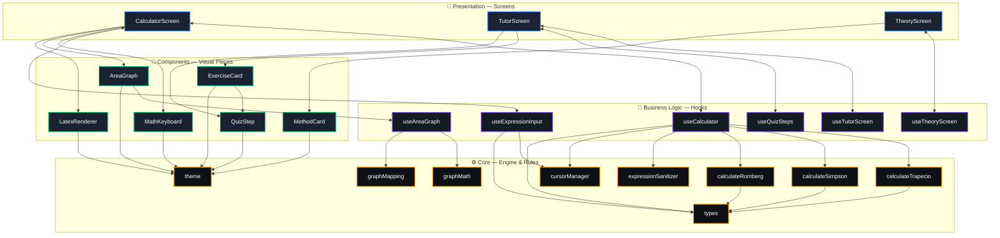
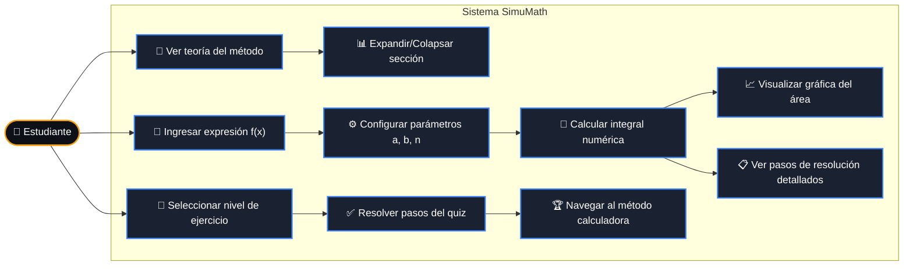
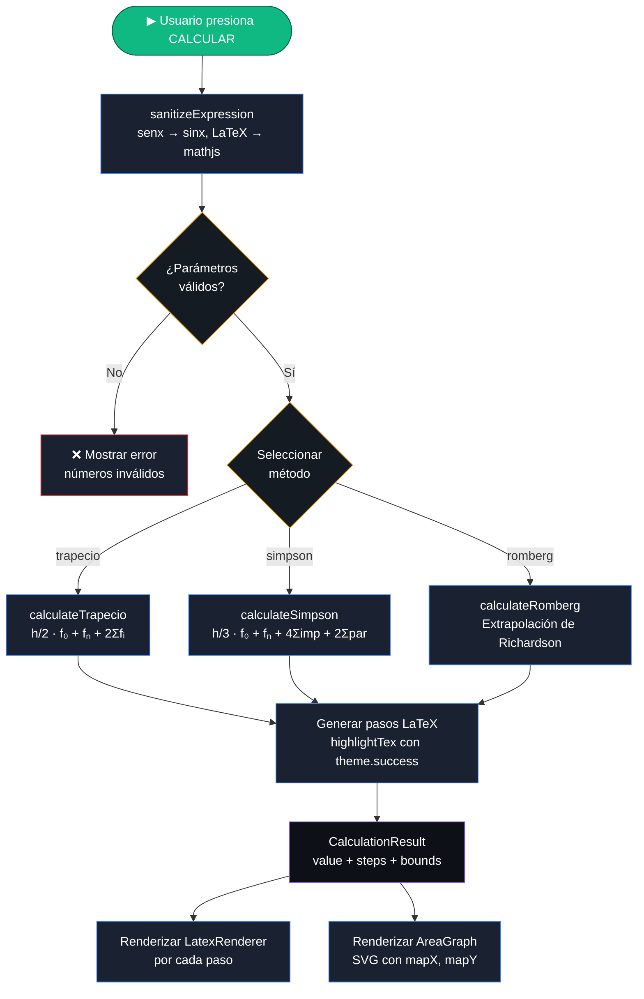
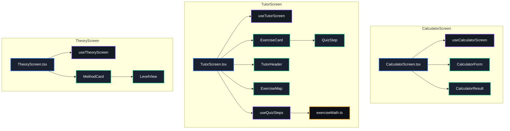
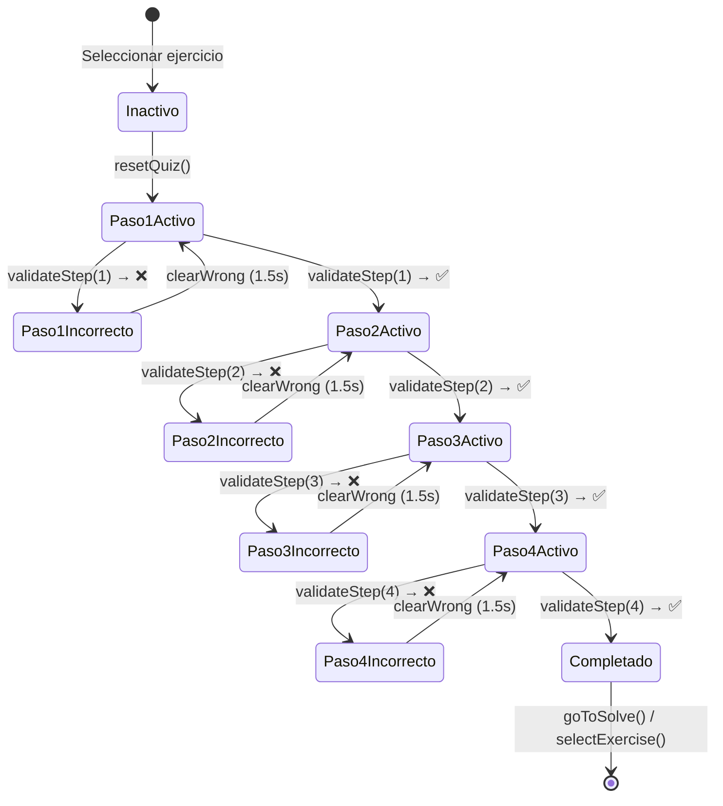
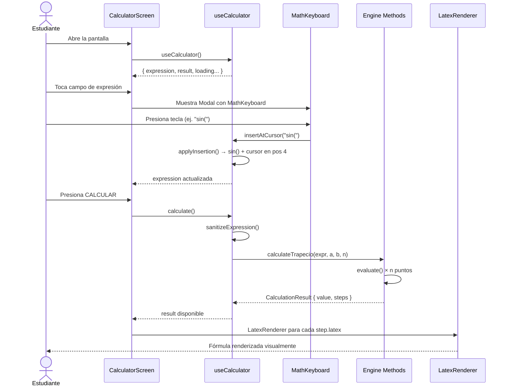

# 🧮 SimuMath — Plataforma de Apoyo de Estudio de Ingeniería de Software FESC

<p align="center">
  
</p>

<p align="center">
  <strong>Aprende. Practica. Domina tu proceso en la Ingeniería de Software FESC.</strong><br/>
  Una aplicación móvil interactiva construida con React Native + Expo.
</p>

<p align="center">
  
  
  
  
</p>

---

## Tabla de Contenidos

- [📱 Descripción del Proyecto](#-descripción-del-proyecto)
- [⚙️ Tecnologías y Librerías](#️-tecnologías-y-librerías)
- [🏗️ Arquitectura del Sistema](#️-arquitectura-del-sistema)
- [📊 Diagramas UML](#-diagramas-uml)
  - [Diagrama de Arquitectura General](#diagrama-de-arquitectura-general)
  - [Diagrama de Casos de Uso](#diagrama-de-casos-de-uso)
  - [Diagrama de Flujo de Cálculo](#diagrama-de-flujo-de-cálculo)
  - [Diagrama de Componentes](#diagrama-de-componentes)
  - [Diagrama de Estados (Quiz)](#diagrama-de-estados-quiz)
  - [Diagrama de Secuencia](#diagrama-de-secuencia)
- [📁 Estructura de Carpetas](#-estructura-de-carpetas)
- [🚀 Cómo Ejecutar el Proyecto](#-cómo-ejecutar-el-proyecto)
- [👥 Autores](#-autores)

---

## 📱 Descripción del Proyecto

**SimuMath** es una plataforma educativa gamificada diseñada como **apoyo de estudio para el programa de Ingeniería de Software de la FESC**. Permite a los estudiantes:

- 📖 **Aprender** los fundamentos teóricos de Trapecio, Simpson 1/3 y Romberg con fórmulas LaTeX interactivas
- 🎯 **Practicar** a través de una ruta de 10 niveles con verificación paso a paso
- 🧮 **Calcular** con una calculadora matemática de expresiones simbólicas con teclado personalizado
- 📈 **Visualizar** el área bajo la curva con gráficas SVG interactivas

---

## ⚙️ Tecnologías y Librerías

### Core

| Librería | Versión | Uso |
|----------|---------|-----|
| `react-native` | 0.73+ | Framework base multiplataforma |
| `expo` | ~50 | SDK y herramientas de desarrollo |
| `typescript` | 5.0+ | Tipado estático |
| `@reduxjs/toolkit` | ^2.0 | Manejo de estado global |
| `react-redux` | ^9.0 | Integración Redux ↔ React |

### Motor Matemático

| Librería | Versión | Uso |
|----------|---------|-----|
| `mathjs` | ^12.0 | Evaluación de expresiones matemáticas |
| `katex` | ^0.16 | Renderizado LaTeX (web) |
| `react-native-webview` | ^13.0 | Renderizado LaTeX (nativo iOS/Android) |

### Gráficas y Visualización

| Librería | Versión | Uso |
|----------|---------|-----|
| `react-native-svg` | ^14.0 | Gráficas SVG vectoriales interactivas |
| `@expo/vector-icons` | ^14.0 | Iconos (MaterialCommunityIcons) |

### Navegación y UI

| Librería | Versión | Uso |
|----------|---------|-----|
| `expo-status-bar` | ~1.11 | Control de la barra de estado |
| `react-navigation` | ^6.0 | Navegación entre pantallas (tabs) |

### Instalación de todas las dependencias

```bash
npm install mathjs katex react-native-webview react-native-svg @expo/vector-icons @reduxjs/toolkit react-redux
```

```bash
npx expo install expo-status-bar react-native-svg react-native-webview
```

---

## 🏗️ Arquitectura del Sistema

SimuMath sigue una arquitectura modular basada en el principio de **separación de responsabilidades**:

> **Un archivo = Una sola responsabilidad**

| Capa | Rol | Analogía |
|------|-----|----------|
| **Screens** | Orquestación de la pantalla | 🎼 Director de orquesta |
| **Hooks** | Lógica de negocio y estado | 🧠 Cerebro |
| **Components** | Piezas visuales reutilizables | 🧩 Piezas de UI |
| **Engine** | Cálculos matemáticos puros | ⚙️ Motor |
| **Utils** | Funciones puras sin estado | 📐 Reglas del juego |
| **Theme** | Sistema de diseño centralizado | 🎨 Paleta única |
| **Types** | Contratos TypeScript | 📋 Definiciones |

---

## 📊 Diagramas UML

### Diagrama de Arquitectura General



---

### Diagrama de Casos de Uso



---

### Diagrama de Flujo de Cálculo



---

### Diagrama de Componentes



---

### Diagrama de Estados (Quiz)



---

### Diagrama de Secuencia



---

## 📁 Estructura de Carpetas

```
📁 src/
├── 📁 components/
│   ├── 📁 calculator/
│   │   ├── 📁 components/      # KeyButton
│   │   ├── 📁 config/          # keyboard.config.ts
│   │   ├── 📁 hooks/           # useMathKeyboard
│   │   ├── MathKeyboard.tsx
│   │   └── MathKeyboard.styles.ts
│   ├── 📁 graph/
│   │   ├── 📁 hooks/           # useAreaGraph
│   │   ├── 📁 utils/           # graphMath, graphMapping
│   │   ├── AreaGraph.tsx
│   │   ├── AreaGraph.styles.ts
│   │   └── AreaGraph.types.ts
│   ├── 📁 latex/
│   │   ├── 📁 hooks/           # useLatexRenderer
│   │   ├── 📁 utils/           # katexTemplate
│   │   ├── LatexRenderer.tsx
│   │   ├── LatexRenderer.web.tsx
│   │   ├── LatexRenderer.styles.ts
│   │   └── LatexRenderer.types.ts
│   └── 📁 shared/
│       ├── 📁 config/          # brand.config.ts
│       ├── BrandHeader.tsx
│       └── BrandHeader.styles.ts
├── 📁 engine/
│   ├── 📁 methods/             # trapecio, simpson, romberg
│   └── 📁 utils/               # latexFormatter
├── 📁 hooks/
│   ├── 📁 utils/               # expressionSanitizer, cursorManager
│   ├── useCalculator.ts
│   └── useExpressionInput.ts
├── 📁 screens/
│   ├── 📁 calculator/
│   │   ├── 📁 components/      # CalculatorForm, CalculatorResult
│   │   ├── 📁 hooks/           # useCalculatorScreen
│   │   ├── CalculatorScreen.tsx
│   │   └── CalculatorScreen.styles.ts
│   ├── 📁 exercises/
│   │   ├── 📁 components/      # TutorHeader, ExerciseMap, ExerciseCard, QuizStep
│   │   ├── 📁 hooks/           # useTutorScreen, useQuizSteps
│   │   ├── 📁 utils/           # exerciseMath
│   │   ├── TutorScreen.tsx
│   │   └── TutorScreen.styles.ts
│   └── 📁 learn/
│       ├── 📁 components/      # MethodCard, LevelView
│       ├── 📁 hooks/           # useTheoryScreen
│       ├── TheoryScreen.tsx
│       └── TheoryScreen.styles.ts
├── 📁 data/
│   ├── 📁 exercises/           # trapecio, simpson, romberg + types
│   └── 📁 theory/              # trapecio, simpson, romberg + types
├── 📁 store/
│   ├── 📁 slices/              # calculatorSlice
│   ├── hooks.ts                # useAppDispatch, useAppSelector
│   └── index.ts
├── 📁 theme/
│   └── index.ts                # Design system: colores, spacing, fonts
└── 📁 types/
    └── index.ts                # Method, CalculationResult, CalculatorState...
```

---

## 🚀 Cómo Ejecutar el Proyecto

### Requisitos previos

- [Node.js](https://nodejs.org/) v18+
- [Expo CLI](https://expo.dev/) instalado globalmente
- [Expo Go](https://expo.dev/go) en tu dispositivo móvil (opcional)

### 1. Clonar el repositorio

```bash
git clone https://github.com/Santiago-Rueda-Q/SimuMath.git
cd SimuMath
```

### 2. Instalar dependencias

```bash
npm install
```

### 3. Ejecutar en desarrollo

```bash
npx expo start
```

Luego escanea el QR con **Expo Go** en tu dispositivo, o presiona:
- `a` → Android Emulator
- `i` → iOS Simulator
- `w` → Navegador Web

### 4. Build de producción

```bash
# Android
npx expo build:android

# iOS
npx expo build:ios
```

---

## 👥 Autores

Desarrollado por **Santiago Rueda Q**.

<p align="center">
  <a href="https://github.com/Santiago-Rueda-Q">
    
  </a>
</p>

**Sirley Sofía Molina León**

---

<p align="center">
  Hecho con ❤️ para los estudiantes de Ingeniería de Software de la FESC.<br/>
  <sub>© 2026 SimuMath – Plataforma de Apoyo de Estudio</sub>
</p>
